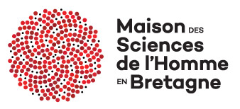
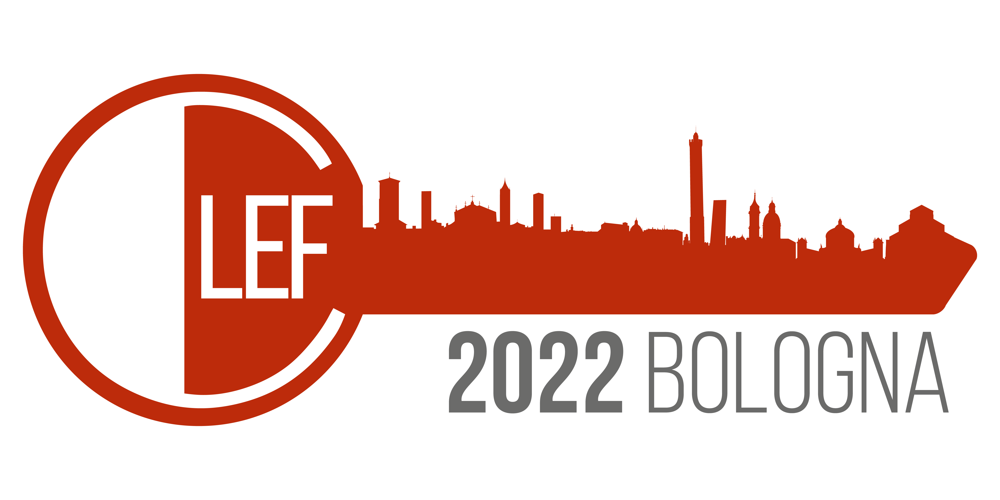

# JokeR

  

[Home](index) | [Project](project) | [Publications](publications) | [Partners](partners) | Contact Us | [Tools](tools) |  
 

## Contact us via:
 

**Twitter:** [https://twitter.com/joker_research](https://twitter.com/joker_research)

**Google Group:** [https://groups.google.com/u/4/g/joker-project](https://groups.google.com/u/4/g/joker-project)

**Email:** [joker.humour.project@gmail.com](mailto:joker.humour.project@gmail.com)

<em>This project has received a government grant managed by the National Research Agency under the program "Investissements d'avenir" with the Reference ANR-19-GURE-0001</em>

<em>JokeR is supported by The Human Science Institute in Brittany (MSHB)</em>

  
  
  

 

   

