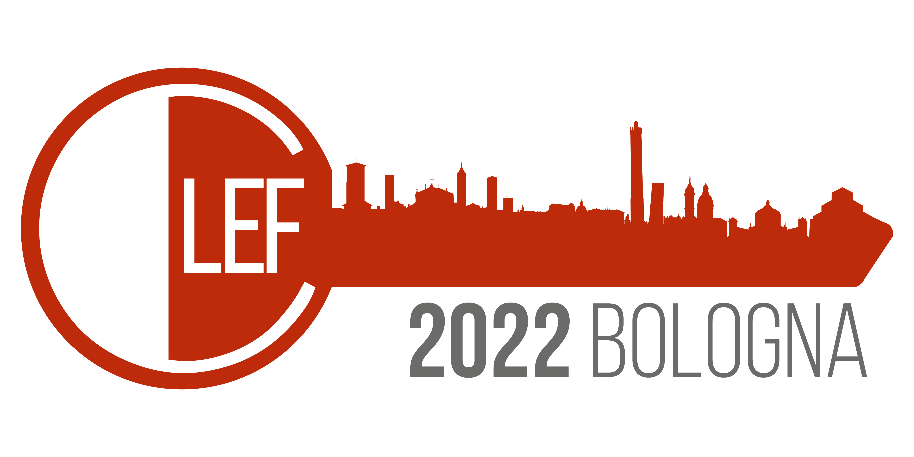

# JokeR

  

  
[Accueil](index) | [Projet](projet) | [Publications](publications) | [Partenaires](partenaires) | Nous contacter | [Outils](outils) | 
 

## Contactez-nous :
 

**Twitter :** [https://twitter.com/joker_research](https://twitter.com/joker_research)

**Google Group :** [https://groups.google.com/u/4/g/joker-project](https://groups.google.com/u/4/g/joker-project)

**Adresse e-mail :** [joker.humour.project@gmail.com](mailto:joker.humour.project@gmail.com)

<em>Ce projet a bénéficié d'une aide de l'état gérée par l'Agence Nationale de la Recherche au titre du programme « Investissements d'avenir » portant la Référence ANR-19-GURE-0001</em>

<em>JokeR est labellisé par la Maison des Sciences de l'Homme en Bretagne</em>

  
  
  

 

   

